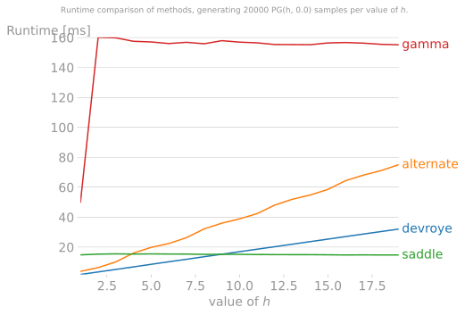
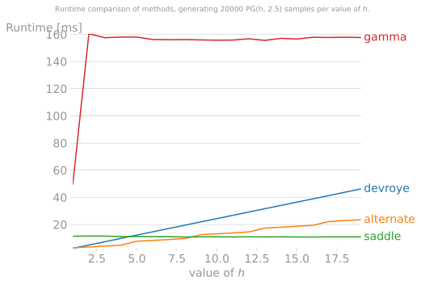
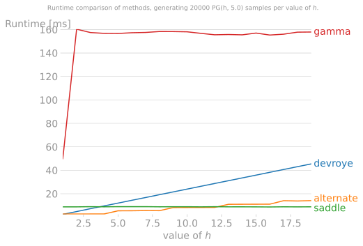
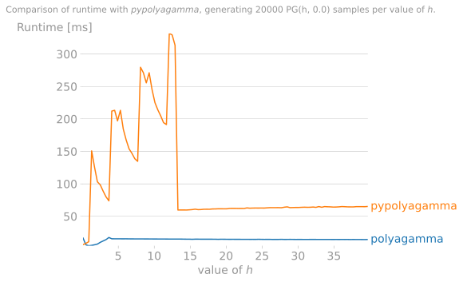
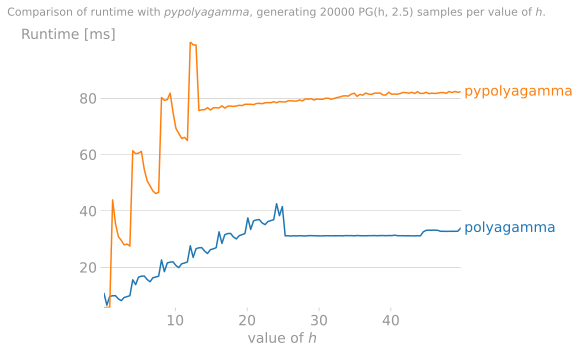
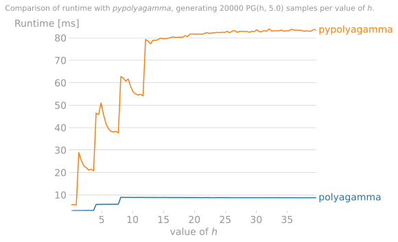
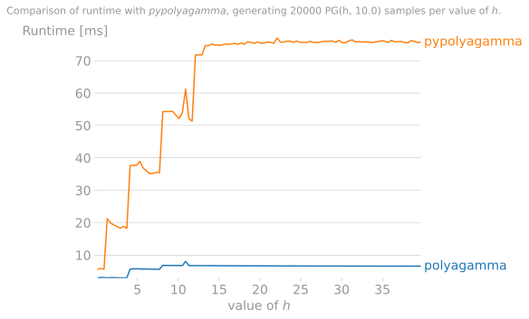
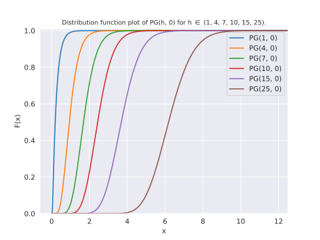
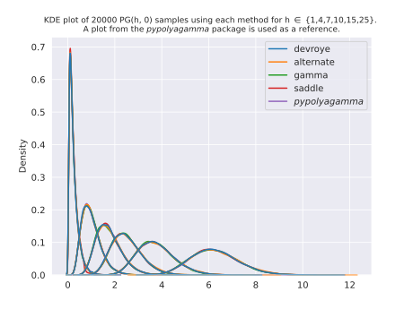

# Polya-Gamma
[![PyPI - Wheel][4]](https://pypi.org/project/polyagamma/#files)
[![CI][7]](https://github.com/zoj613/polyagamma/actions/workflows/build-and-test.yml)
[![Codecov][8]](https://codecov.io/gh/zoj613/polyagamma/)
[![PyPI - License][6]](https://github.com/zoj613/polyagamma/blob/main/LICENSE)
[![PyPI][5]](https://pypi.org/project/polyagamma/#history)
[![Conda][11]](https://anaconda.org/conda-forge/polyagamma)


Efficiently generate samples from the Polya-Gamma distribution using a NumPy/SciPy compatible interface.

## Why?

If you are reading this, you probably have already used the [pypolyagamma][9] package before. It is
a great package that I have also used in the past, however I encountered several issues:
- Generating an array of samples is awkward because it requires using a list comprehension
  if parameter values are scalars or have pre-allocated arrays of a known size to pass for both
  the parameters and the output array. Moreover, broadcasting of input is not supported and thus
  requiring the user to write another layer to support it.
- It requires extra effort to be used in multiprocessing because pickling of the
  sampler is not supported.
- There is no parameter validation supported meaning it is easy to get the wrong samples if
  you do not check the inputs manually.
- The sampling API is very different from the ones used by popular packages like numpy/scipy,
  making it harder to just "plug-n-play" in existing code bases.
- It does not allow passing in an instance of a `np.random.RandomState` or `np.random.Generator`
  for seeding, requiring extra effort when changing the seed if used in a larger code base.
- The C++ code wrapped by the package is GPLv3 licensed, making it difficult to
  use the source code in a project that prefers licenses like MIT/Apache/BSD.

The above issues are the reason why this package exists. And the aim of `polyagamma` is to "fix" them.


## Features
- Input parameters can be scalars, arrays or both; allowing for easy generation
of multi-dimensional samples without specifying the size.
- Input validation is done internally with clear error messages upon failure.
- It is flexible and allows the user to sample using one of 4 available algorithms.
- Implements functions to compute the CDF and density of the distribution as well
  as their logarithms.
- Random number generation is thread safe.
- The functional API resembles that of common numpy/scipy functions, therefore making it easy to plugin to
existing libraries.
- `polyagamma` is optimized for performance and tests show that it is faster
  than other implementations.
- Pre-built wheels are provided for easy installation on Linux, MacOS and Windows.


## Examples

### Python

```python
import array
import numpy as np
from polyagamma import random_polyagamma

# generate a PG(1, 0) sample
o = random_polyagamma()

# Get a 5 by 1 array of PG(1, 2) variates.
o = random_polyagamma(z=2, size=5)

# We can pass sequences as input. Numpy's broadcasting rules apply here.
# Get a 10 by 2 array where column 1 is PG(2, -10) and column 2 is PG(1, 10)
o = random_polyagamma([2, 1], [-10, 10], size=(10, 2))
z = [[1.5, 2, -0.75, 4, 5],
     [9.5, -8, 7, 6, -0.9]]
o = random_polyagamma(1, z)

# We can pass an output array using the `out` parameter. It does not have to be
# a numpy array. it can be any object that implements the array or buffer protocols.
# As long as its type is 64bit float, contiguous in memory and aligned (e.g. Python's array object).
numpy_out = np.empty(5)
array_out = array.array('d', [0] * 5)
random_polyagamma(out=numpy_out)
print(numpy_out)
random_polyagamma(out=array_out)
print(array_out)

# one can choose a sampling method from {devroye, alternate, gamma, saddle}.
# If not given, the default behaviour is a hybrid sampler that picks the most
# efficient method based on the input values.
o = random_polyagamma(method="saddle")

# one can also use an existing instance of `numpy.random.Generator` as a parameter.
# This is useful to reproduce samples generated via a given seed.
rng = np.random.default_rng(12345)
o = random_polyagamma(random_state=rng)

# If one is using a `numpy.random.RandomState` instance instead of the `Generator`
# class, the object's underlying bitgenerator can be passed as the value of random_state
bit_gen = np.random.RandomState(12345)._bit_generator
o = random_polyagamma(random_state=bit_gen)

# When passing a large input array for the shape parameter `h`, parameter value
# validation checks can be disabled if the values are guaranteed to be positive
# to avoid some overhead, which may boost performance.
large_h = np.ones(1000000)
o = random_polyagamma(large_h, disable_checks=True)
```
Functions to compute the density and CDF are available. Broadcasting of input is supported.
```python
from polyagamma import polyagamma_pdf, polyagamma_cdf

>>> polyagamma_pdf(0.1)
# 3.613955566329298
>>> polyagamma_cdf([1, 2], h=2, z=1)
# array([0.95637847, 0.99963397])
>>> polyagamma_pdf([2, 0.1], h=[[1, 2], [3, 4]], return_log=True)
# array([[   -8.03172733,  -489.17101125]
#        [   -3.82023942, -1987.09156971]])
>>> polyagamma_cdf(4, z=[-100, 0, 2], return_log=True)
# array([ 3.72007598e-44, -3.40628215e-09, -1.25463528e-12])
```

### Cython
The package also provides low-level functions that can be imported in cython modules. They are:
- `random_polyagamma`
- `random_polyagamma_fill`
- `random_polyagamma_fill2`

Refer to the [pgm_random.h](./include/pgm_random.h) header file for more info about the
function signatures. Below is an example of how these functions can be used.

```cython
from cpython.pycapsule cimport PyCapsule_GetPointer
from polyagamma cimport random_polyagamma_fill, DEVROYE
from numpy.random cimport bitgen_t
import numpy as np

# assuming there exists an instance of the Generator class called `rng`.
bitgenerator = rng._bit_generator
# get pointer to the underlying bitgenerator struct
cdef bitgen_t* bitgen = <bitgen_t*>PyCapsule_GetPointer(bitgenerator.capsule, "BitGenerator")
# set distribution parameters
cdef double h = 1, z = 0
# get a memory view of the array to store samples in
cdef double[:] out = np.empty(300)
with bitgenerator.lock, nogil:
    random_polyagamma_fill(bitgen, h, z, DEVROYE, <size_t>out.shape[0], &out[0])
print(out.base)
...
```

### PyMC
As of `pymc>=4.0.0b1`, this distribution can be accessed as a PyMC distribution object. See the
pymc documentation for more details.

### C
For an example of how to use `polyagamma` in a C program, see [here][1].


## Dependencies
- Numpy >= 1.19.0


## Installation
To get the latest version of the package, one can install it by downloading the wheel/source distribution 
from the [releases][3] page, or using `pip` with the following shell command:
```shell
$ pip install --pre -U polyagamma
```
or using `conda` with the following command:
```shell
$ conda install -c conda-forge polyagamma
```
Alternatively, once can install from source with the following shell commands:
```shell
$ git clone https://github.com/zoj613/polyagamma.git
$ cd polyagamma/
$ pip install .
```


## Benchmarks

Below are runtime plots of 20000 samples generated for various values of `h` 
and `z`, using each method. We restrict `h` to integer values to accomodate the 
`devroye` method, which cannot be used for non-integer `h`. The version of the
package used to generate them is `v1.3.1`.

| | |
| --- | --- |

| | |
| --- | --- |

Generally:
- The `gamma` method is slowest and should be avoided in cases where speed is paramount.
- For `h >= 8`, the `saddle` method is the fastest for any value of `z`.
- For `0 <= z <= 1` and integer `h <= 4`, the `devroye` method should be preferred.
- For `z > 1` and `1 < h < 8`, the `alternate` method is the most efficient.
- For `h > 50` (or any value large enough), the normal approximation to the distribution is 
fastest (not reported in the above plot but it is around 10 times faster than the `saddle` 
method and also equally accurate).

Therefore, we devise a "hybrid/default" sampler that picks a sampler based on the above guidelines.

We also benchmark the hybrid sampler runtime with the sampler found in the `pypolyagamma` 
package (version `1.2.3`). The version of NumPy we use is `1.19.0`. We compare our
sampler to the `pgdrawv` functions provided by the package. Below are runtime plots of 20000
samples for each value of `h` and `z`. Values of `h` range from 0.1 to 50, while `z` is set
to 0, 2.5, 5, and 10.

| | |
| --- | --- |

| | |
| --- | --- |

It can be seen that when generating many samples at once for any given combination of 
parameters, `polyagamma` outperforms the `pypolyagamma` package by a large margin.
The exception is when the scale parameter is very small (e.g `h < 1`). It is also worth
noting that the `pypolygamma` package is on average faster than ours at generating exactly 1
sample value from the distribution. This is mainly due to the overhead introduced by creating
the bitgenerator + acquiring/releasing the thread lock + doing parameter validation checks at
every call to the function. This overhead can somewhat be mitigated by passing in a random
generator instance at every call to the `polyagamma` function. To eliminate this overhead,
it is best to use the Cython functions directly. Below is a timing example to demonstrate
the benefit of passing a generator explicitly:
```shell
In [3]: rng = np.random.SFC64(1)

In [4]: %timeit random_polyagamma()
90 µs ± 1.65 µs per loop (mean ± std. dev. of 7 runs, 10000 loops each)

In [5]: %timeit random_polyagamma(random_state=rng)
1.69 µs ± 6.96 ns per loop (mean ± std. dev. of 7 runs, 1000000 loops each)
```

To generate the above plots locally, run
```shell
$ pip install -r scripts/requirements.txt
$ python scripts/benchmark.py --size=<some size> --z=<z value>
```
Note that the runtimes may differ  than the ones reported here, depending on the machine this script 
is ran on.


## Distribution Plots
Below is a visualization of the Cumulative distribution and density functions for
various values of the parameters.
| | |
| --- | --- |

We can compare these plots to the Kernel density estimate and empirical CDF plots
generated from 20000 random samples using each of the available methods.
| | |
| --- | --- |


## Contributing
All contributions, bug reports, bug fixes, documentation improvements, enhancements, and ideas are welcome.

To submit a PR, follow the steps below:
1) Fork the repo.
2) Install and setup the dev environment with `pip install -r requirements-dev.txt` or `make dev`.
3) Start writing your changes, including unittests.
4) Run tests to make sure they all pass with `make test`.
5) Once finished, you can submit a PR for review.


## References
- Luc Devroye. "On exact simulation algorithms for some distributions related to Jacobi theta functions." Statistics & Probability Letters, Volume 79, Issue 21, (2009): 2251-2259.
- Polson, Nicholas G., James G. Scott, and Jesse Windle. "Bayesian inference for logistic models using Pólya–Gamma latent variables." Journal of the American statistical Association 108.504 (2013): 1339-1349.
- J. Windle, N. G. Polson, and J. G. Scott. "Improved Polya-gamma sampling". Technical Report, University of Texas at Austin, 2013b.
- Windle, Jesse, Nicholas G. Polson, and James G. Scott. "Sampling Polya-Gamma random variates: alternate and approximate techniques." arXiv preprint arXiv:1405.0506 (2014)
- Windle, J. (2013). Forecasting high-dimensional, time-varying variance-covariance matrices with high-frequency data and sampling Pólya-Gamma random variates for posterior distributions derived from logistic likelihoods.(PhD thesis). Retrieved from http://hdl.handle.net/2152/21842 .


[1]: ./examples/c_polyagamma.c
[3]: https://github.com/zoj613/polyagamma/releases
[4]: https://img.shields.io/pypi/wheel/polyagamma?style=flat-square
[5]: https://img.shields.io/github/v/release/zoj613/polyagamma?include_prereleases&label=pypi&style=flat-square
[6]: https://img.shields.io/pypi/l/polyagamma?style=flat-square
[7]: https://img.shields.io/github/workflow/status/zoj613/polyagamma/CI/main?style=flat-square
[8]: https://img.shields.io/codecov/c/github/zoj613/polyagamma?style=flat-square
[9]: https://github.com/slinderman/pypolyagamma
[10]: https://github.com/python-poetry/poetry
[11]: https://img.shields.io/conda/vn/conda-forge/polyagamma?style=flat-square
