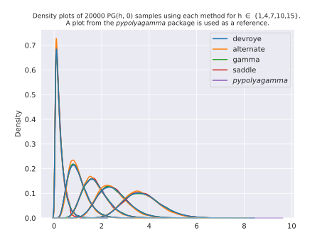
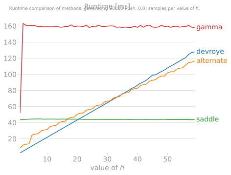
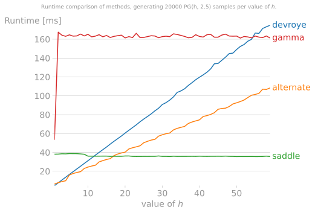
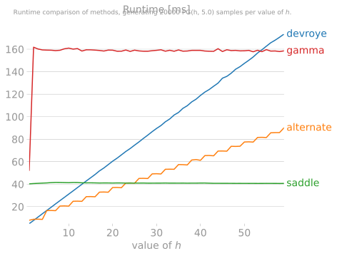
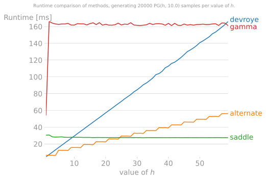
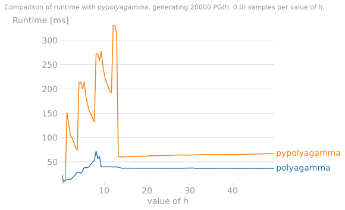
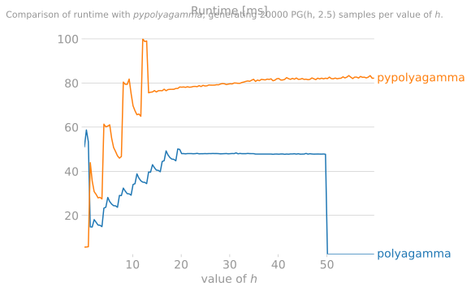
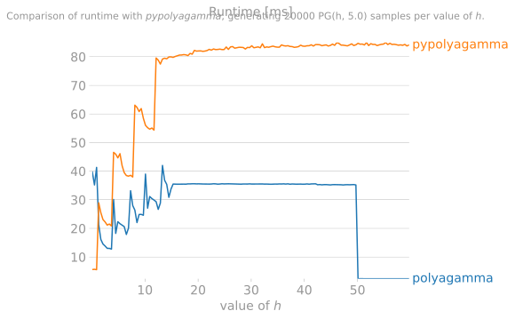
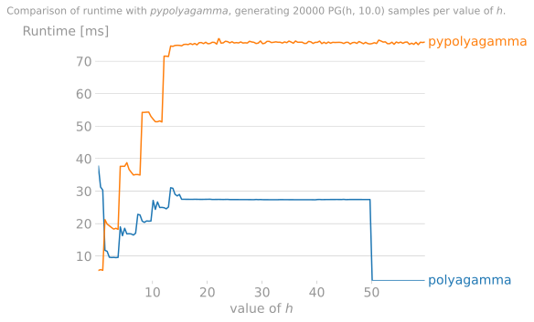

# polya-gamma
[![PyPI - Wheel][4]](https://pypi.org/project/polyagamma/#files)
[![PyPI][5]](https://pypi.org/project/polyagamma/#history)
[![PyPI - License][6]](https://github.com/zoj613/polyagamma/blob/main/LICENSE)
[![CircleCI][7]](https://circleci.com/gh/zoj613/polyagamma/)
[![Codecov][8]](https://codecov.io/gh/zoj613/polyagamma/)
[![PyPI - Downloads][9]](https://pypistats.org/packages/polyagamma)


Efficiently generate samples from the Polya-Gamma distribution using a NumPy/SciPy compatible interface.



## Features
- `polyagamma` is written in C and optimized for performance.
- Very light and easy to install (pre-built wheels).
- It is flexible and allows the user to sample using one of 4 available methods.
- Input parameters can be scalars, arrays or both; allowing for easy generation
of multi-dimensional samples without specifying the size.
- Random number generation is thread safe.
- The functional API resembles that of common numpy/scipy functions, therefore making it easy to plugin to
existing libraries.


## Dependencies
- Numpy >= 1.17 


## Installation
To get the latest version of the package, one can install it by downloading the wheel/source distribution 
from the [releases][3] page, or using `pip` with the following shell command:
```shell
$ pip install polyagamma
```
To install the latest pre-release version, use:
```shell
$ pip install --pre -U polyagamma
```
Alternatively, once can install from source by cloning the repo. This requires an installation of [poetry][2]
and the following shell commands:
```shell
$ git clone https://github.com/zoj613/polya-gamma.git
$ cd polya-gamma/
$ poetry install
# add package to python's path
$ export PYTHONPATH=$PWD:$PYTHONPATH 
```

## Example

### Python

```python
import numpy as np
from polyagamma import polyagamma

# generate a PG(1, 0) sample
o = polyagamma()

# Get a 5 by 10 array of PG(1, 2) variates.
o = polyagamma(z=2, size=(5, 10))

# Pass sequences as input. Numpy's broadcasting rules apply here.
h = [[1.5, 2, 0.75, 4, 5],
     [9.5, 8, 7, 6, 0.9]]
o = polyagamma(h, -2.5)

# Pass an output array
out = np.empty(5)
polyagamma(out=out)
print(out)

# one can choose a sampling method from {devroye, alternate, gamma, saddle}.
# If not given, the default behaviour is a hybrid sampler that picks a method
# based on the parameter values.
o = polyagamma(method="saddle")

# one can also use an existing instance of `numpy.random.Generator` as a parameter.
# This is useful to reproduce samples generated via a given seed.
rng = np.random.default_rng(12345)
o = polyagamma(random_state=rng)

# If one is using a `numpy.random.RandomState` instance instead of the `Generator`
# class, the object's underlying bitgenerator can be passed as the value of random_state
bit_gen = np.random.RandomState(12345)._bit_generator
o = polyagamma(random_state=bit_gen)

# When passing a large input array for the shape parameter `h`, parameter value
# validation checks can be disabled to avoid some overhead, which may boost performance.
large_h = np.ones(1000000)
o = polyagamma(large_h, disable_checks=True)
```
### C
For an example of how to use `polyagamma` in a C program, see [here][1].


## Benchmarks

Below are runtime plots of 20000 samples generated for various values of `h` 
and `z`, using each method. We restrict `h` to integer values to accomodate the 
`devroye` method, which cannot be used for non-integer `h`. The version of the
package used to generate them is `v1.1.0-beta.3`.

 | 
| --- | --- |

 | 
| --- | --- |

Generally:
- The `gamma` method is slowest and should be avoided in cases where speed is paramount.
- For `h > 15`, the `saddle` method is the fastest for any value of `z`.
- For `z <= 1` and integer `h <= 15`, the `devroye` method is the most efficient.
- For `z > 1` and integer/non-integer `h <= 15`, the `alternate` method is the most efficient.
- For `h > 50` (or any value large enough), the normal approximation to the distribution is 
fastest (not reported in the above plot but it is around 10 times faster than the `saddle` 
method and also equally accurate).

Therefore, we devise a "hybrid/default" sampler that picks a sampler based on the above guidelines.

We also benchmark the hybrid sampler runtime with the sampler found in the `pypolyagamma` 
package (version `1.2.3`). The version of NumPy we use is `1.19.4`. We use the `pgdrawv` 
function which takes arrays as input. Below are runtime plots of 20000 samples for each 
value of `h` and `z`. Values of `h` range from 0.1 to 60, while `z` is set to 0, 2.5, 5, and 10.
 | 
| --- | --- |

 | 
| --- | --- |

It can be seen that when generating many samples at once for any given combination of 
parameters, `polyagamma` outperforms the `pypolyagamma` package. The exception is when 
`h < 1`. We rely on the `saddle` method to generate samples when the shape parameter is 
very small, which is not very efficient for such values. For values of `h` larger than 50, 
we use the normal approximation, which explains the large dip in runtime past `h=50`. 
It is also worth noting that the `pypolygamma` package is on average faster than ours at 
generating exactly one sample from the distribution. This is mainly due to the 
overhead introduced by creating the bitgenerator + acquiring/releasing the thread lock + 
doing parameter validation checks at every call to the function. This overhead can 
somewhat be mitigated by passing in a random generator instance at every call to 
the `polyagamma` function. For example, on an `iPython` session:
```ipynb
In [4]: %timeit polyagamma()
94.6 µs ± 1.25 µs per loop (mean ± std. dev. of 7 runs, 10000 loops each)
In [9]: %timeit polyagamma(random_state=rng)
4.95 µs ± 15.8 ns per loop (mean ± std. dev. of 7 runs, 100000 loops each)
```


To generate the above plots locally, run `python scripts/benchmark.py --size=<some size> --z=<z value>`.
Note that the runtimes may differ  than the ones reported here, depending on the machine this script 
is ran on.


## Contributing
All contributions, bug reports, bug fixes, documentation improvements, enhancements, and ideas are welcome.

To submit a PR, follow the steps below:
1) Fork the repo.
2) Setup the dev environment with `poetry install`. All dependencies will be installed.
3) Start writing your changes, including unittests.
3) Once finished, run `make install` to build the project with the new changes.
4) Once build is successful, run tests to make sure they all pass with `make test`.
5) Once finished, you can submit a PR for review.


## References
- Luc Devroye. "On exact simulation algorithms for some distributions related to Jacobi theta functions." Statistics & Probability Letters, Volume 79, Issue 21, (2009): 2251-2259.
- Polson, Nicholas G., James G. Scott, and Jesse Windle. "Bayesian inference for logistic models using Pólya–Gamma latent variables." Journal of the American statistical Association 108.504 (2013): 1339-1349.
- J. Windle, N. G. Polson, and J. G. Scott. "Improved Polya-gamma sampling". Technical Report, University of Texas at Austin, 2013b.
- Windle, Jesse, Nicholas G. Polson, and James G. Scott. "Sampling Polya-Gamma random variates: alternate and approximate techniques." arXiv preprint arXiv:1405.0506 (2014)
- Windle, J. (2013). Forecasting high-dimensional, time-varying variance-covariance matrices with high-frequency data and sampling Pólya-Gamma random variates for posterior distributions derived from logistic likelihoods.(PhD thesis). Retrieved from http://hdl.handle.net/2152/21842 .


[1]: ./examples/c_polyagamma.c
[2]: https://python-poetry.org/docs/pyproject/
[3]: https://github.com/zoj613/polyagamma/releases
[4]: https://img.shields.io/pypi/wheel/polyagamma?style=flat-square
[5]: https://img.shields.io/github/v/release/zoj613/polyagamma?include_prereleases&style=flat-square
[6]: https://img.shields.io/pypi/l/polyagamma?style=flat-square
[7]: https://img.shields.io/circleci/build/github/zoj613/polyagamma/main?style=flat-square
[8]: https://img.shields.io/codecov/c/github/zoj613/polyagamma?style=flat-square
[9]: https://img.shields.io/pypi/dm/polyagamma?style=flat-square
